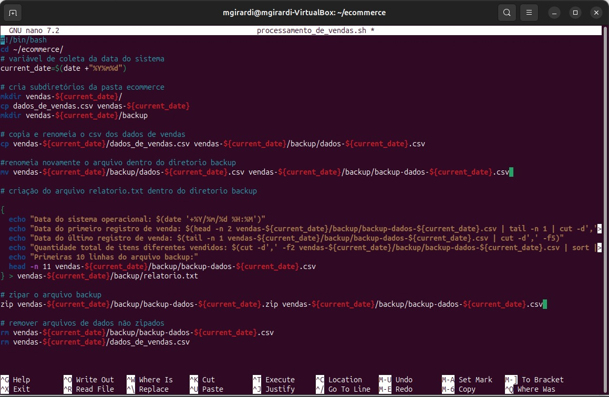

# Cursos
Durante o curso sobre Linux, adquiri conhecimentos essenciais para o uso e administração desse sistema operacional. Iniciei com uma compreensão teórica do Linux, sobre suas distribuições e também a definição de kernel. Reforcei comandos básicos como navegação no terminal, manipulação de arquivos e diretórios, usuários,; instalação e gerenciamento de pacotes e aplicativos, técnicas de busca e filtragem de arquivos, compactação e descompactação de arquivos utilizando ferramentas como tar e zip, entre outros que eu já havia tido contato em algumas matérias da faculdade.

Familiarizei-me melhor com editores de texto como nano e vim, fundamentais para editar arquivos de configuração e scripts. Também explorei conceitos básicos de rede.  Esses conhecimentos me proporcionam uma base sólida para administrar sistemas Linux de forma eficiente.

Já durante o curso de Git e Github aprendi do zero todos uma grande parte de comandos e conceitos que eu não tinha ideia de como funcionava. Desde criar, conectar e gerir diretórios, foi muito interessante aprender todos eles. Além de todos os comandos do terminal git bash que abordavam repositórios, branchs, stashs e tags e etc, o curso também deu uma apresentada no site do github, e como utiliza-lo devidamente. No fim, foi reforçado alguns conceitos básicos de MarkDown, que foram perfeitos para ajudar na edição do repositório do programa de bolsas

# Exercícios

1. ...
[Resposta Ex1.](exercicios/ex1.txt)

2. ...
[Resposta Ex2.](exercicios/ex2.txt)

# Evidências

Ao executar o código do exercício ele gera todos os arquivos e diretórios necessários do desafio, conforme visto nos comentários do sh. 

# Certificados

- Certificado do Curso ABC

