# O Desafio Final: Dashboard no AWS QuickSight

Agora, será evidenciado e explicado toda a trajetória de desenvolvimento do dashboard final do desafio do programa de bolsas.

# Etapas

## Correção de algumas coisas antes de começar...

Antes de iniciar a produção do dashboard, gostaria de esclarecer que realizei algumas alterações nos dados em relação ao que foi feito nas sprints 8 e 9. De forma resumida, reestruturei os conjuntos de dados para melhor organização, separando-os em tabelas que representam as dimensões e a tabela fato. Além disso, adicionei uma coluna que anteriormente estava faltando para aprimorar a análise. Abaixo, estão os prints dos jobs utilizados e do novo modelo dimensional.

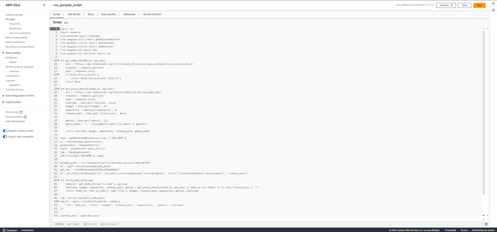
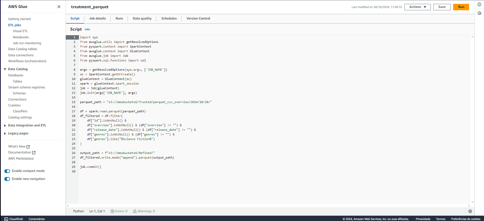
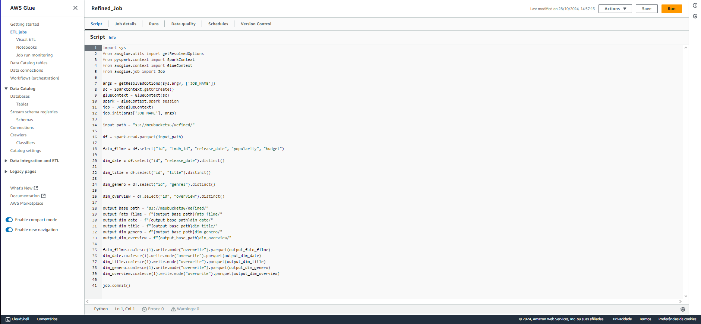
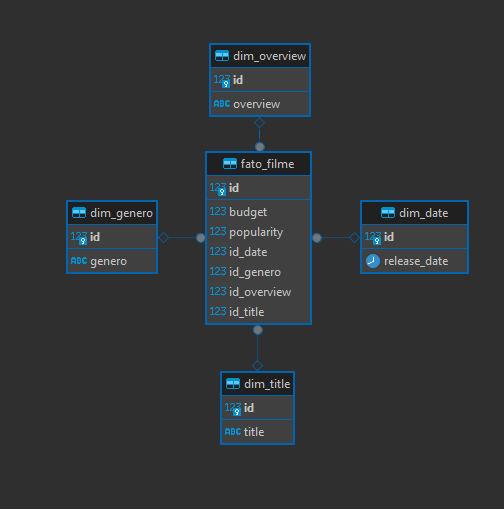

## Relação de Joins

Aqui está a representação das ligações dos conjuntos de dados, basicamente, a tabela fato_filme da Left Join em todas as outras dimensões usando o id como chave primária;
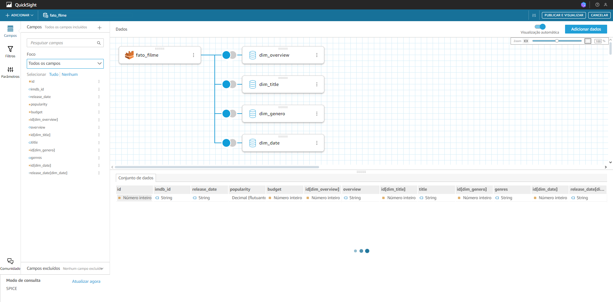

--- 

## Introdução do Dashboard

A primeira página do dashboard serve como uma introdução para a análise, que se baseia em uma amostra de 4698 filmes de Ficção Científica, e é destinada a investigar a popularização do tema de filmes sobre alienígenas, levando como ponto de pesquisa o lançamento do primeiro filme da franquia "Alien", de 1979.

De início já se faz uma comparação com a média de popularidade dos filmes na amostra (10,28) e especificamente daqueles que mencionam "Alien" em suas sinopses (15,3), e foi utilizado um filtro nos dados de 'overview' para a palavra-chave. Também é evidenciado a média de orçamento geral de todos os filmes da amostra, bem como a média para cada ano (do filme mais velho para o filme mais novo), em dólares americanos.

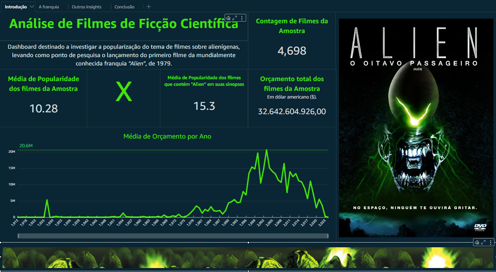

---

## A Franquia

A página a seguir funciona como um seletor dos filmes da franquia "Alien", permitindo a escolha de filmes específicos através de um controlador configurado com os IDs de cada filme presentes no conjunto de dados. Esse controlador foi implementado como um filtro da coluna de IDs. Para cada filme selecionado, são exibidos detalhes como título, ano de lançamento, popularidade, orçamento e sinopse, facilitando a análise individual de cada produção. Além disso, um campo calculado associa cada ID a um URL específico, exibindo o pôster correspondente ao filme.

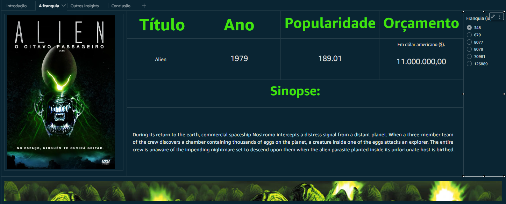
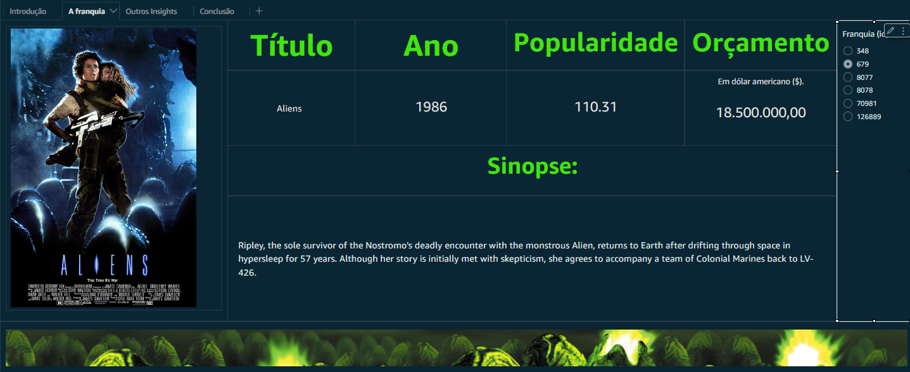
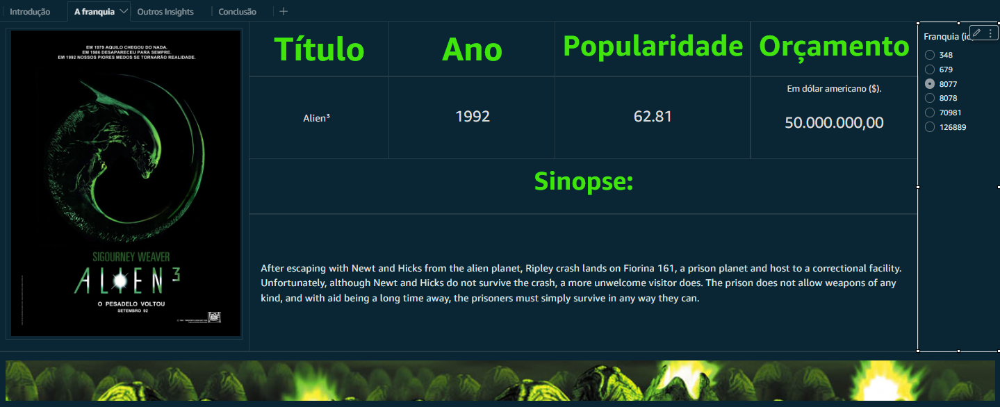

---

## Outros Insights

Já a terceira parte do dashboard apresenta dois gráficos essenciais para responder à pesquisa proposta. O gráfico de rosca mostra as combinações de gêneros que mais frequentemente acompanham o Sci-Fi em filmes sobre alienígenas, destacando que o próprio gênero "Science Fiction" aparece em primeiro lugar tanto isoladamente, mas também é comumente associado com horror, comédia e ação – esse gráfico possui um controlador que funciona com um parâmetro que possui uma lista com as décadas, usado como filtro para o campo calculado campo_decada.

À direita, talvez o mais importante do dashboard e também o idealizado na sprint 6, o gráfico de barras exibe o impacto do filme "Alien" (1979) no aumento de filmes com temas alienígenas ao longo das décadas, evidenciando um crescimento significativo a partir dos anos 1980, logo após o lançamento do filme. Ademais, é interessante destacar que houve um pico na produção desses filmes na década de 2010, muito provavelmente explicado devido ao avanço na tecnologia do cinema, com efeitos especiais e etc.

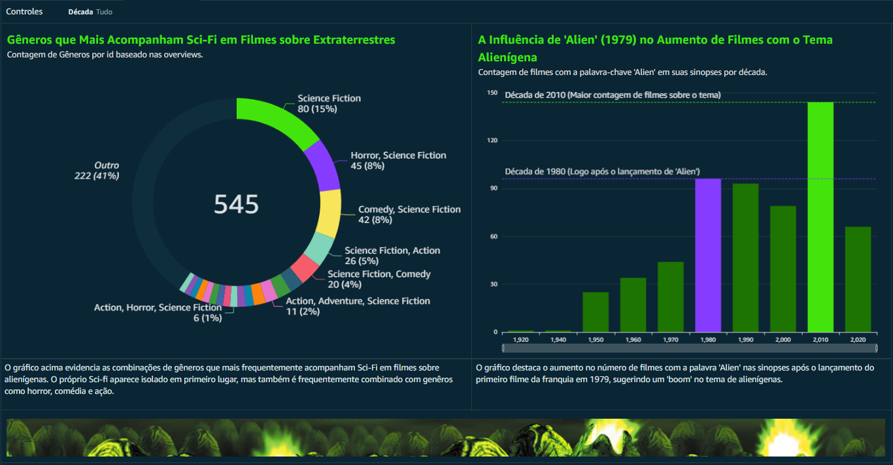
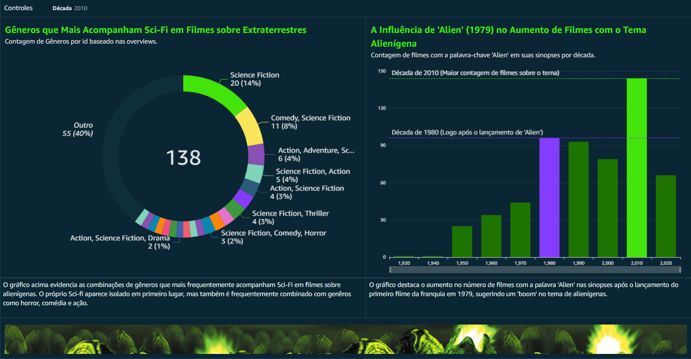

---

## Conclusão

Por fim, uma página de conclusão também faz parte do dashboard. Há quatro gráficos de KPI que destacam os principais indicadores da franquia, que destacam o filme de maior popularidade, a média de popularidade e de orçamento da franquia, e o filme com o maior orçamento.

Com base nos dados da amostra e nos gráficos anteriores, é possível concluir que a franquia "Alien" desempenhou um papel significativo na popularização do tema de alienígenas no cinema. Após o lançamento do primeiro filme da franquia e suas sequências, observou-se um aumento de mais de 200% na produção de filmes que abordam esse tema em comparação com a década anterior.

No entanto, não é possível afirmar com certeza se esse crescimento foi diretamente impulsionado pela franquia ou se ela foi apenas parte desse movimento cinematográfico. Uma possível interpretação é que o tema de alienígenas ganhou destaque naquela época devido a grandes eventos na astronomia, como a corrida espacial durante a Guerra Fria, especialmente o primeiro pouso lunar na década anterior. Esses acontecimentos podem ter influenciado o imaginário coletivo e aumentado o interesse por narrativas de ficção científica voltadas para o desconhecido e o espaço.

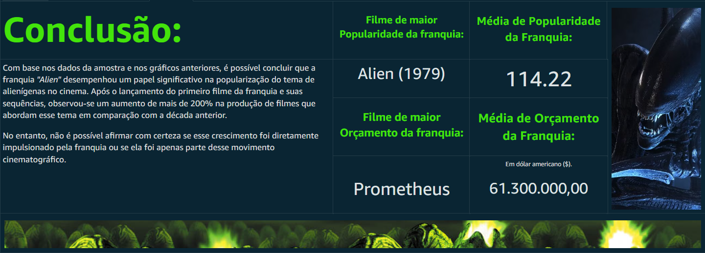
