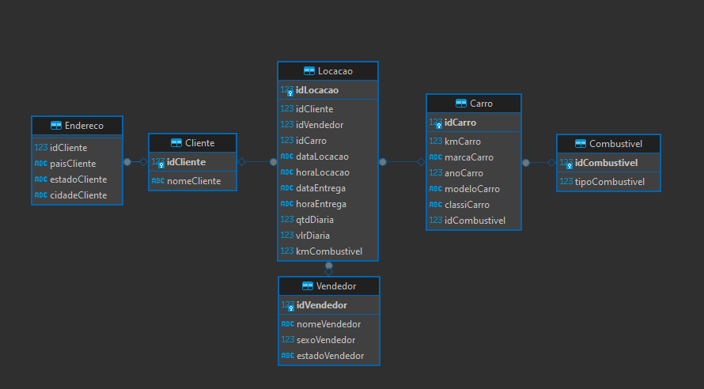
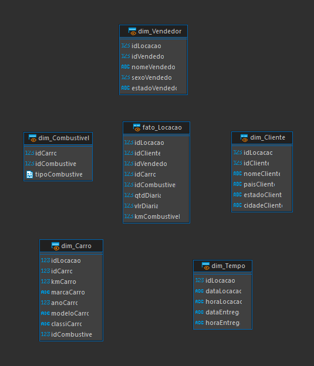

# Etapas
Ao criar as tabelas a partir do a tabela tb_locacao do desafio, e também redistribuir os dados aplicando os níveis de normalização usando os arquivos .sql: [normalização](Desafio/etapa-1/normalizacao.sql) e [insert](Desafio/etapa-1/insert.sql) cheguei ao modelo relacional abaixo: 

Depois, foi necessário criar também o modelo dimensional com as Views fato e dim, baseado no modelo relacional anterior, conforme requerido na etapa 4.2 do Desafio. Então, usando o arquivo [create_views](Desafio/etapa-1/create_Views.sql), foram-se criados as visualizações.

1. ...
[Etapa I](etapa-1/entrega.txt)

2. ...
[Etapa II](etapa-2/entrega.txt)

