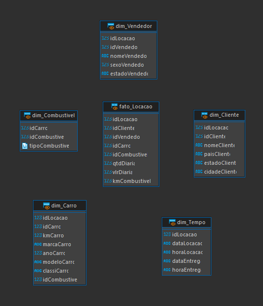

# Cursos
O curso de SQL estudado abordou tópicos essenciais para todo desenvolvedor de banco de dados. O curso começa tratando dos comandos básicos, que são fundamentais para toda e qualquer interação com dados utilizando SQL. Em seguida, falou sobre os operadores, que são cruciais para realizar operações e comparações, enquanto as funções de agregação permitem resumir, sumarizar e analisar conjuntos de dados. 

Também é mister destacar o estudo de joins, que são uma das mais importantes funções em SQL para combinar dados de diferentes tabelas, habilidade essencial para qualquer desenvolvedor que trabalha com dados. Uniões e Subqueries são importantes para criar consultas complexas e eficientes. Também, ao final do curso, foi reforçado os métodos de construção e manutenção de tabelas.

Resumidamente, esses tópicos foram muito bem estruturados, indubitavelmente necessários para aprender desenvolver, otimizar e manter sistemas de banco de dados robustos e confiáveis.

Além disso foi estudado o curso da AWS Partner, que foi muito interessante para entender os conceitos básicos de nuvem de forma organizada, bem como os serviços da Amazon para cloud, e como vender os produtos dela com vendas conjuntas.

# Exercícios

1. ...
[Resposta Ex1.](exercicios/ex1.sql)

2. ...
[Resposta Ex2.](exercicios/ex2.sql)

3. ...
[Resposta Ex3.](exercicios/ex3.sql)

4. ...
[Resposta Ex4.](exercicios/ex4.sql)

5. ...
[Resposta Ex5.](exercicios/ex5.sql)

6. ...
[Resposta Ex6.](exercicios/ex6.sql)

7. ...
[Resposta Ex7.](exercicios/ex7.sql)

8. ...
[Resposta Ex8.](exercicios/ex8.sql)

9. ...
[Resposta Ex9.](exercicios/ex9.sql)

10. ...
[Resposta Ex10.](exercicios/ex10.sql)

11. ...
[Resposta Ex11.](exercicios/ex11.sql)

12. ...
[Resposta Ex12.](exercicios/ex12.sql)

13. ...
[Resposta Ex13.](exercicios/ex13.sql)

14. ...
[Resposta Ex14.](exercicios/ex14.sql)

15. ...
[Resposta Ex15.](exercicios/ex15.sql)

16. ...
[Resposta Ex16.](exercicios/ex16.sql)

II. ...
[Resposta ExII.](exercicios/exII.sql)

# Evidências

Ao criar as tabelas a partir do a tabela tb_locacao do desafio, e também redistribuir os dados aplicando os níveis de normalização usando os arquivos .sql: [normalização](Desafio/etapa-1/normalizacao.sql) e [insert](Desafio/etapa-1/insert.sql) cheguei ao modelo relacional abaixo: 

Depois, foi necessário criar também o modelo dimensional com as Views fato e dim, baseado no modelo relacional anterior, conforme requerido na etapa 4.2 do Desafio. Então, usando o arquivo [create_views](Desafio/etapa-1/create_Views.sql), foram-se criados as visualizações.

# Certificados

- Certificado do Curso ABC

