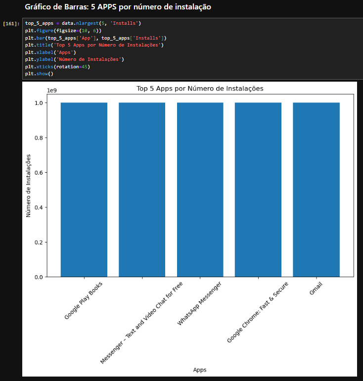
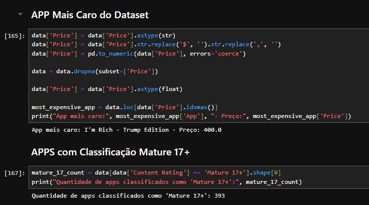
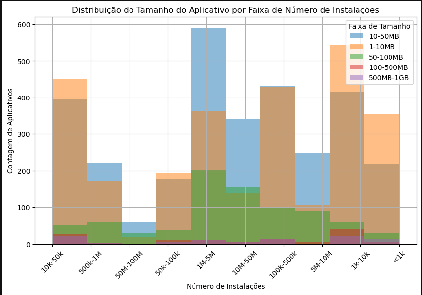

# Desafio
   
  [Etapa I](etapa-1/Desafio_Sprint_3MGG.ipynb)
  
Estas três células preparam os dados do arquivo CSV, removem duplicatas e convertem colunas específicas para o formato numérico para facilitar análises subsequentes.

Depois, foi feito o plot de um gráfico de barras, com os parâmetros: Apps x Numero de instalação, retornando um top 5 dos apps.

Nesse Pie Chart, a análise foi a quantidade quantidade de apps por categoria.

Nessas duas outras células, o foco era encontrar o aplicativo mais caro do dataset e também coletar a quantidade de apps com o Content rating "Mature 17+".

Na primeira célula, o foco era encontrar o top 10 apps por número de reviews. Já na segunda acontece duas consultas diferentes, uma para encontrar o top 5 apps por numero de review e por categoria "Medical" e a outra encontrar o app menos instalado do banco.

Esse gráfico de linhas mostra a relação entre faixas de preço e classificações de conteúdo para aplicativos da Google Play Store. No eixo x, apresenta as faixas de preço, e no y o número de apps.

O último gráfico mostra um histograma, que analisa a distribuição do tamanho dos aplicativos em diferentes faixas de número de instalações.

