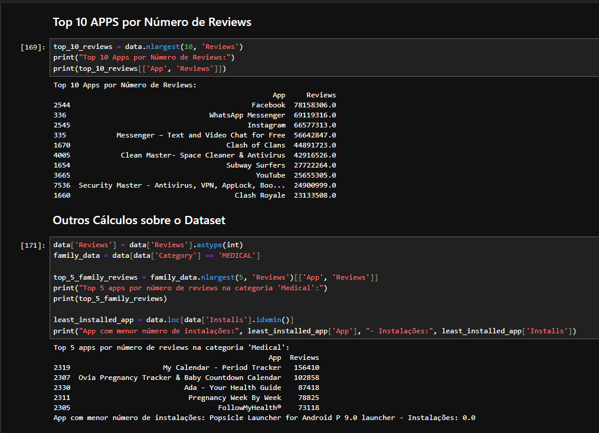

# Cursos

Durante a Sprint 3, o foco dos estudos foi todo voltado para o aprendizado da linguagem Python, abordando também o tratamento de dados e a geração de gráficos. O curso "Python 3 - Curso Completo do Básico ao Avançado" disponibilizado pela Udemy foi essencial para o desenvolvimento das atividades e do desafio final.

No curso, foram tratados desde a instalação da linguagem e configuração do ambiente no computador, até a explicação do que é e para que serve o Python. A familiarização com a linguagem ocorreu por meio de comandos básicos e explicações detalhadas sobre a sintaxe e seu funcionamento. Passar pelos fundamentos foi extremamente útil, pois formaram uma base sólida para o entendimento e desenvolvimento das atividades.

O curso passou por várias etapas, incluindo tópicos específicos como estruturas de controle, manipulação de arquivos CSV (de grande utilidade para o desenvolvimento do desafio), conhecimento de funções, orientação a objetos, entre outros. Em resumo, o curso foi de extrema importância para estabelecer os pilares não só do Python, mas também da programação e lógica em geral, que serão utilizados durante todo o programa de bolsas.

Além disso, foi proposto o estudo do curso "AWS: Cloud Economics". Embora mais sucinto, este curso foi importante para o entendimento de conceitos cruciais para as próximas etapas do programa, reforçando o entendimento das condutas da empresa e seus pilares.

Este conjunto de estudos proporcionou uma base teórica e prática essencial para o desenvolvimento das atividades e para o progresso contínuo no programa de bolsas.

# Exercícios

1. ...
[Resposta Ex1.](exercicios/ex01.py)

2. ...
[Resposta Ex2.](exercicios/ex02.py)

3. ...
[Resposta Ex3.](exercicios/ex03.py)

4. ...
[Resposta Ex4.](exercicios/ex04.py)

5. ...
[Resposta Ex5.](exercicios/ex05.py)

6. ...
[Resposta Ex6.](exercicios/ex06.py)

7. ...
[Resposta Ex7.](exercicios/ex07.py)

8. ...
[Resposta Ex8.](exercicios/ex08.py)

9. ...
[Resposta Ex9.](exercicios/ex09.py)

10. ...
[Resposta Ex10.](exercicios/ex10.py)

11. ...
[Resposta Ex11.](exercicios/ex11.py)

12. ...
[Resposta Ex12.](exercicios/ex12.py)

13. ...
[Resposta Ex13.](exercicios/ex13.py)

14. ...
[Resposta Ex14.](exercicios/ex14.py)

15. ...
[Resposta Ex15.](exercicios/ex15.py)

16. ...
[Resposta Ex16.](exercicios/ex16.py)

17. ...
[Resposta Ex17.](exercicios/ex17.py)

18. ...
[Resposta Ex18.](exercicios/ex18.py)

19. ...
[Resposta Ex19.](exercicios/ex19.py)

20. ...
[Resposta Ex20.](exercicios/ex20.py)

21. ...
[Resposta Ex21.](exercicios/ex21.py)

22. ...
[Resposta Ex22.](exercicios/ex22.py)

23. ...
[Resposta Ex23.](exercicios/ex23.py)

24. ...
[Resposta Ex24.](exercicios/ex24.py)

25. ...
[Resposta Ex25.](exercicios/ex25.py)

### Exercício ETL com Python
[Resposta ExETL.](exercicios/Exercicio_ETL.ipynb)

# Evidências

## Evidências Exercícios
1. Exercicio 1

2. Exercicio 2

3. Exercicio 3

4. Exercicio 4

5. Exercicio 5

6. Exercicio 6

7. Exercicio 7

8. Exercicio 8

9. Exercicio 9

10. Exercicio 10

11. Exercicio 11

12. Exercicio 12

13. Exercicio 13

14. Exercicio 14

15. Exercicio 15

16. Exercicio 16

17. Exercicio 17

18. Exercicio 18

19. Exercicio 19

20. Exercicio 20

21. Exercicio 21

22. Exercicio 22

23. Exercicio 23

24. Exercicio 24

25. Exercicio 25

## Evidências Desafio

Estas três células preparam os dados do arquivo CSV, removem duplicatas e convertem colunas específicas para o formato numérico para facilitar análises subsequentes.

Depois, foi feito o plot de um gráfico de barras, com os parâmetros: Apps x Numero de instalação, retornando um top 5 dos apps.

Nesse Pie Chart, a análise foi a quantidade quantidade de apps por categoria.

Nessas duas outras células, o foco era encontrar o aplicativo mais caro do dataset e também coletar a quantidade de apps com o Content rating "Mature 17+".

Na primeira célula, o foco era encontrar o top 10 apps por número de reviews. Já na segunda acontece duas consultas diferentes, uma para encontrar o top 5 apps por numero de review e por categoria "Medical" e a outra encontrar o app menos instalado do banco.

Esse gráfico de linhas mostra a relação entre faixas de preço e classificações de conteúdo para aplicativos da Google Play Store. No eixo x, apresenta as faixas de preço, e no y o número de apps.

O último gráfico mostra um histograma, que analisa a distribuição do tamanho dos aplicativos em diferentes faixas de número de instalações.

# Certificados

- Certificado do Curso AWS

