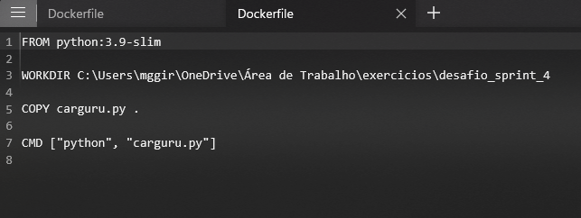
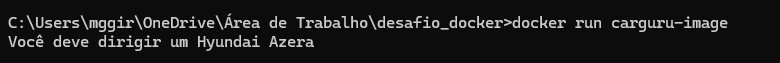
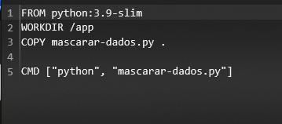
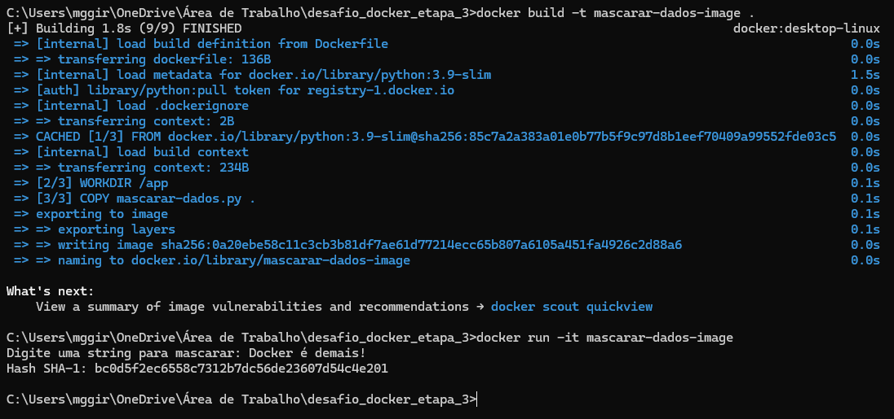

# Etapas

### Etapa 1

Primeiramente, começa-se o desafio com um a seguinte proposta. a Etapa 1 se resume a criar uma imagem e rodar um arquivo python solicitado do desafio que executa um seguinte script, e então, dar "run" no container. Para isso, deveria criar um arquivo Dockerfile com instruções que irão construir a imagem do desafio. Abaixo as instruções.

Após isso, é necessário rodar o comando docker build -t no cmd para construir a imagem, estando dentro do diretório onde está o Dockerfile.

Então, pode-se usar o comando docker run para rodar o container.

### Etapa 2

A segunda etapa do desafio se baseava em um questionamento sobre se é possível reutilizar um container, o qual é possível, utilizando o comando docker ps-a para listar os containers que já foram rodados, e usando o comando start (idcontainer) para reutilizar o container selecionado.

### Etapa 3

A terceira etapa requeria que fosse desenvolvido outro container, o qual pudera receber inputs durante a execução. Para isso, foi criado o arquivo mascarar-dados.py, que contém um script que gera um hash de uma string inserida por meio do algoritmo SHA-1, e então, imprime na tela.

E após, usar um arquivo dockerfile para construção da imagem e rodar os comandos no terminal para construí-la e executá-la.

