# Instruções

Durante a Sprint 4, o foco dos estudos foi totalmente voltado para o aprendizado do Docker, abordando desde conceitos básicos até práticas avançadas de orquestração. O curso "Docker para desenvolvedores" disponível na Udemy foi fundamental para o desenvolvimento das atividades e para a consolidação do conhecimento sobre containers.

No curso, foram abordados desde a introdução aos conceitos de containers e Docker, passando pela instalação e configuração do ambiente. A familiarização com a ferramenta ocorreu por meio de comandos básicos, criando e gerenciando containers e imagens, conexão com redes para comunicação com múltiplos containers, formato YAML, Docker Swarm para orquesteração, Kubernetes, entre outros. Isso foi essencial para formar uma base sólida de compreensão sobre o uso de Docker.

Este curso foi de extrema importância para consolidar conhecimentos práticos que serão utilizados ao longo do desenvolvimento do programa de bolsas e no desafio final relacionado à aplicação de containers em ambiente de produção.

Acrescentando também que foi introduzido uma outra sessão do curso de Python, que ensinou valiosos recursos de programação funcional, como lambdas, high order functions, etc. que foram utilizados nos exercícios da sprint.

# Exercícios

1. ...
[Resposta Ex1.](exercicios/ex01.py)

2. ...
[Resposta Ex2.](exercicios/ex02.py)

3. ...
[Resposta Ex3.](exercicios/ex03.py)

4. ...
[Resposta Ex4.](exercicios/ex04.py)

5. ...
[Resposta Ex5.](exercicios/ex05.py)

6. ...
[Resposta Ex6.](exercicios/ex06.py)

7. ...
[Resposta Ex7.](exercicios/ex07.py)

# Evidências

## Evidências Exercícios
1. Exercicio 1

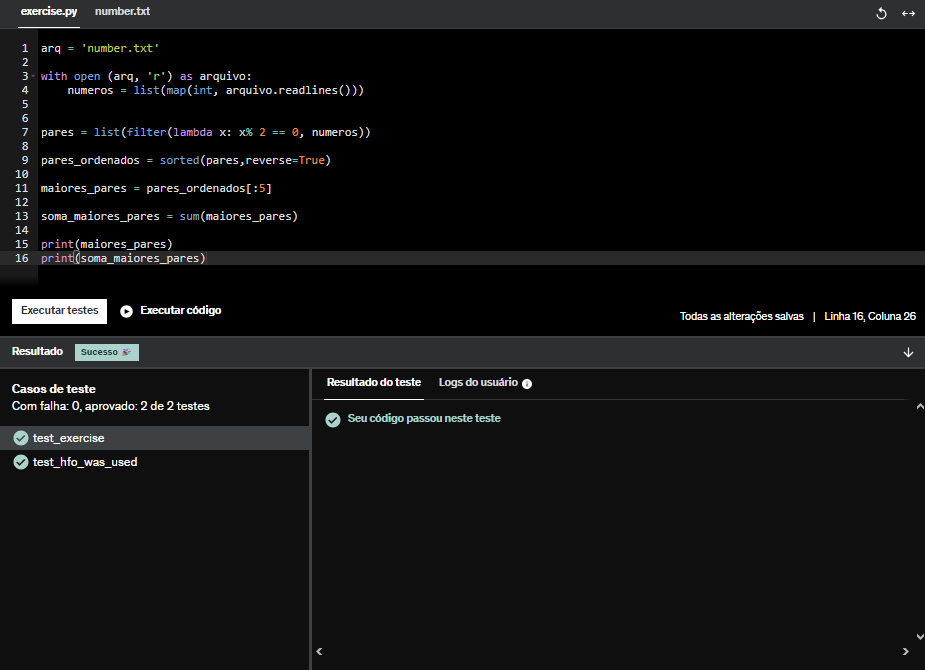

2. Exercicio 2

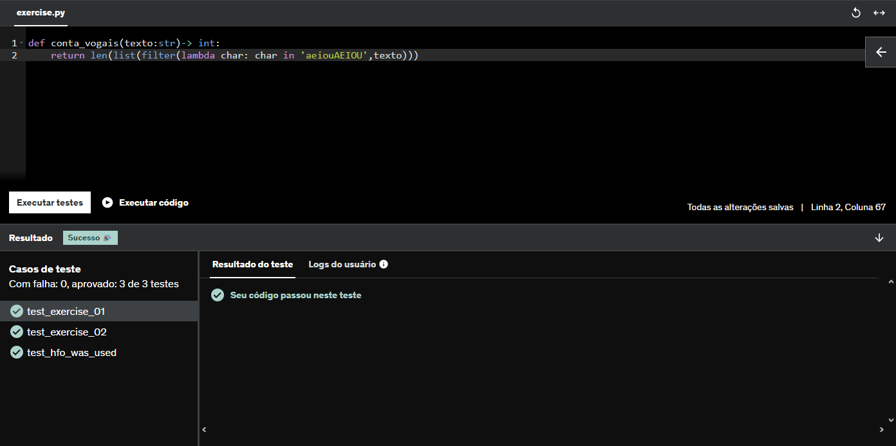

3. Exercicio 3

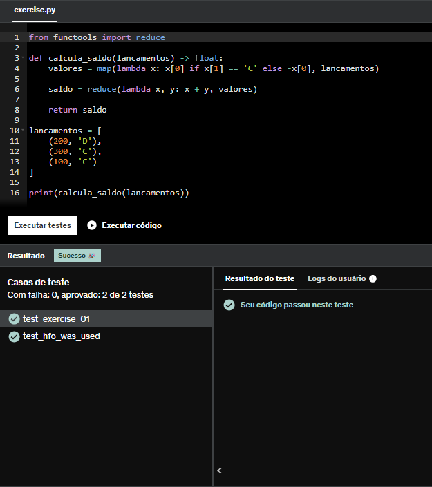

4. Exercicio 4

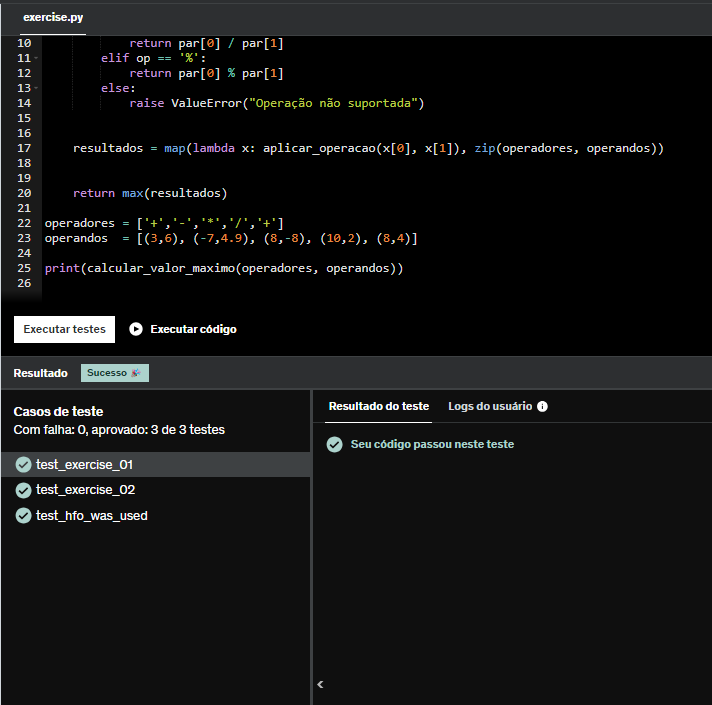

5. Exercicio 5

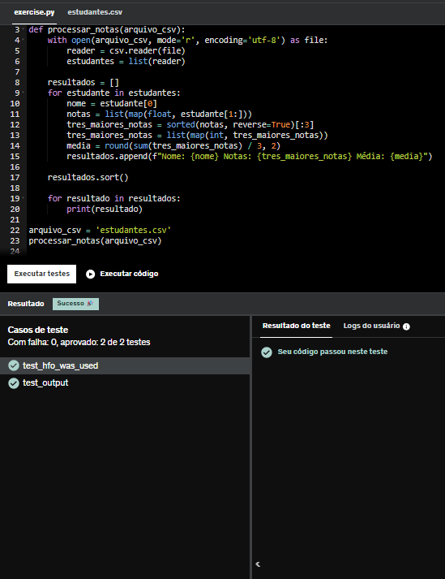

6. Exercicio 6

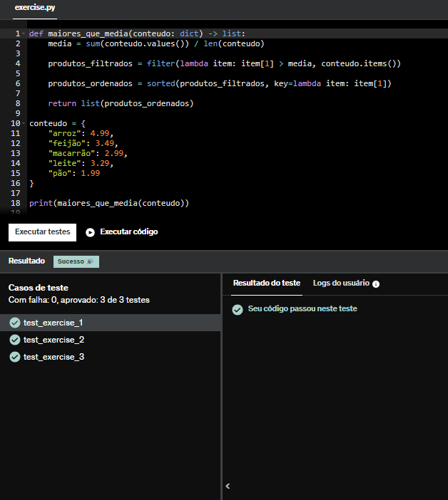

7. Exercicio 7

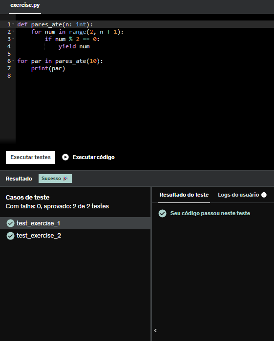

## Evidências Desafio

### Etapa 1

Primeiramente, começa-se o desafio com um a seguinte proposta. a Etapa 1 se resume a criar uma imagem e rodar um arquivo python solicitado do desafio que executa um seguinte script, e então, dar "run" no container. Para isso, deveria criar um arquivo Dockerfile com instruções que irão construir a imagem do desafio. Abaixo as instruções.

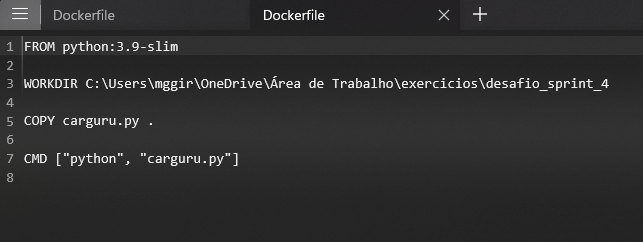

Após isso, é necessário rodar o comando docker build -t no cmd para construir a imagem, estando dentro do diretório onde está o Dockerfile.

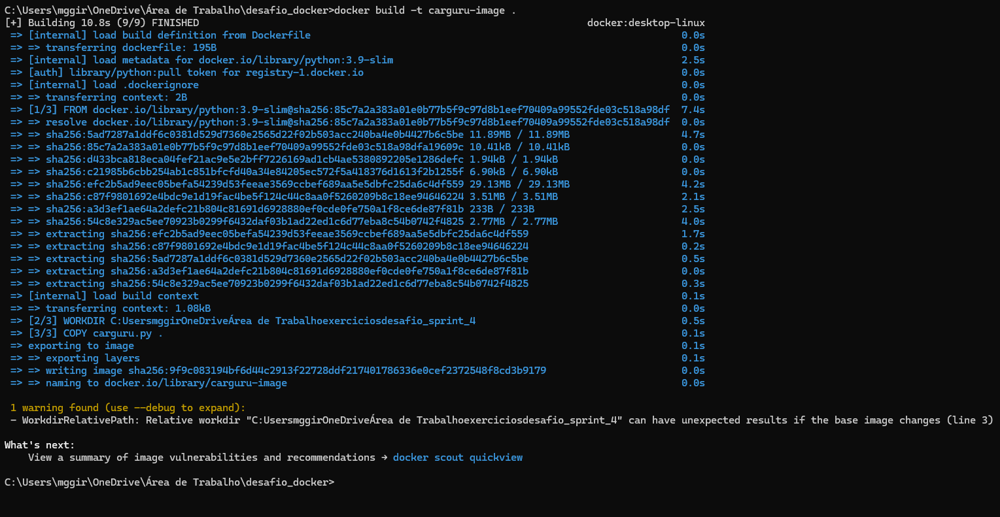

Então, pode-se usar o comando docker run para rodar o container.

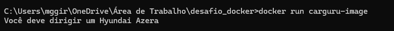

### Etapa 2

A segunda etapa do desafio se baseava em um questionamento sobre se é possível reutilizar um container, o qual é possível, utilizando o comando docker ps-a para listar os containers que já foram rodados, e usando o comando start (idcontainer) para reutilizar o container selecionado.

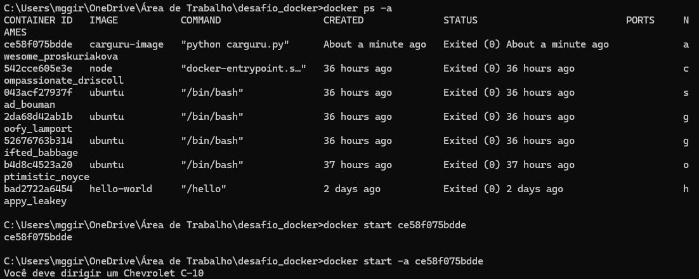

### Etapa 3

A terceira etapa requeria que fosse desenvolvido outro container, o qual pudera receber inputs durante a execução. Para isso, foi criado o arquivo mascarar-dados.py, que contém um script que gera um hash de uma string inserida por meio do algoritmo SHA-1, e então, imprime na tela.

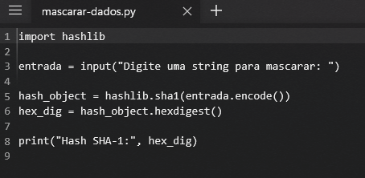

E após, usar um arquivo dockerfile para construção da imagem e rodar os comandos no terminal para construí-la e executá-la.

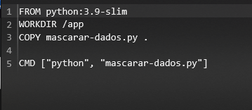
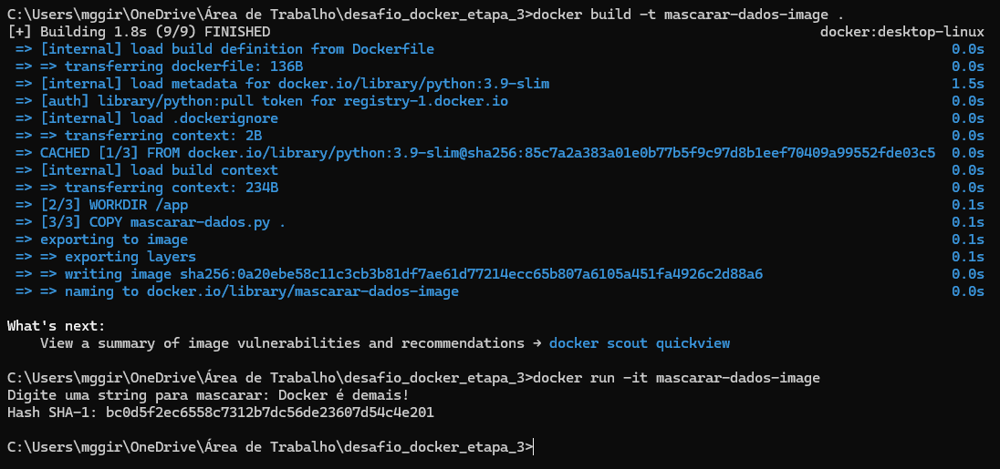

# Certificados

- Certificado do Curso AWS
[Curso AWS](certificados/AWS-Course-Completion-Certificate.pdf)

