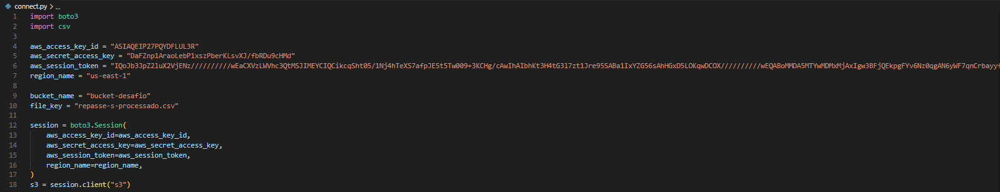
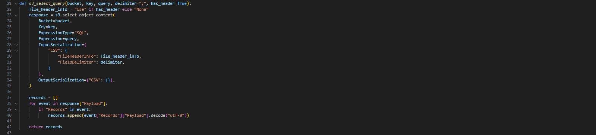
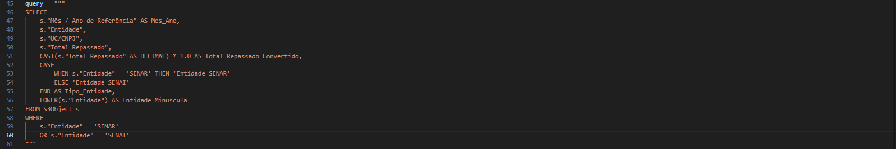
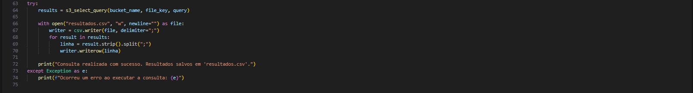
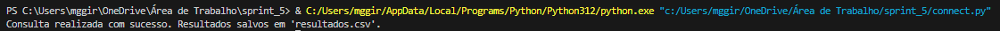
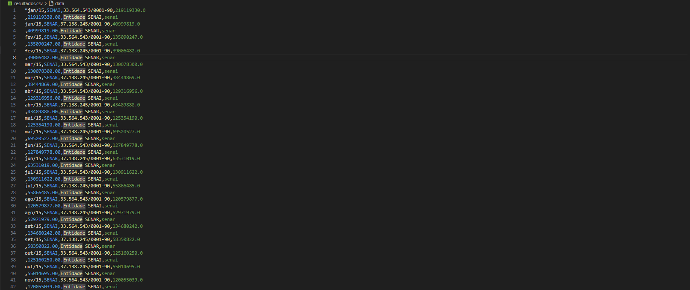
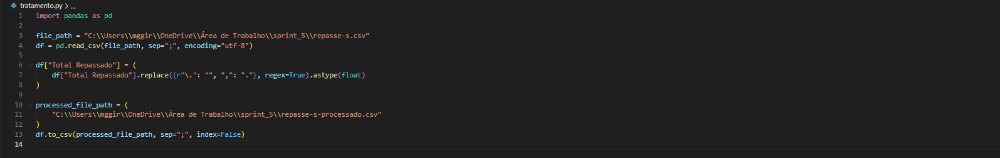

# Desafio

# Etapas

## 1. Conexão usando Boto3
   
Nessa etapa era necessário usar as credenciais para fazer a conexão com o Boto3 na AWS.
   

## 2. S3 Select Query

A função s3_select_query executa uma consulta SQL em um arquivo CSV armazenado no Amazon S3 usando o recurso S3 Select, especificando se o CSV tem cabeçalho, qual delimitador usa, e processa os resultados da consulta retornando uma lista de registros decodificados para uso posterior.

## 3. Query

Essa consulta SQL seleciona colunas específicas de um arquivo CSV no S3, incluindo o mês e ano de referência, entidade, UC/CNPJ e total repassado, e cria uma coluna adicional para classificar a entidade como 'Entidade SENAR' ou 'Outras Entidades'; também converte o nome da entidade para maiúsculas e filtra os resultados para incluir apenas as entidades 'SENAR' ou 'SENAI' nos meses de janeiro.

## 4. Try

Esse trecho de código tenta executar uma consulta usando a função s3_select_query para obter dados de um objeto armazenado no S3. Se a consulta for bem-sucedida, ele abre um arquivo chamado resultados.csv para escrita e usa um csv.writer para salvar os resultados no formato CSV, delimitado por ponto e vírgula. Cada resultado é processado para remover espaços em branco e separado por ponto e vírgula antes de ser escrito no arquivo. Caso ocorra algum erro durante o processo, uma mensagem de erro é exibida, indicando o problema.

# 5. Resultado

## Tratamento do CSV

Foi utilizado um código para tratar alguns problemas do CSV original, como vírgulas que iriam se tornar um problema no futuro.

