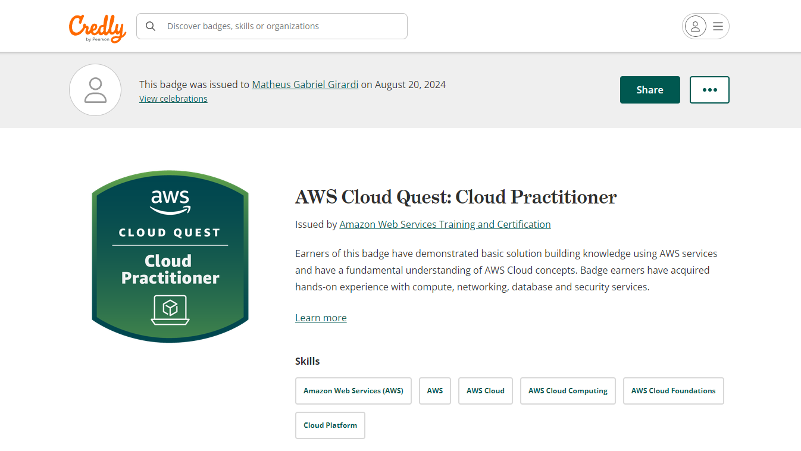
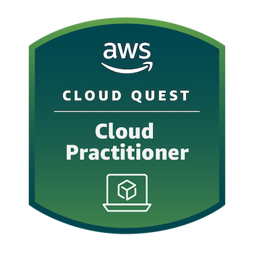

# Resumo
Durante a Sprint 5, não houveram cursos para assistir como houveram nas sprints anteriores. O sprint em si foi envolto de um jogo da AWS, chamado "Cloud Quest", que possuía vários "minigames" os quais serviam de simulações de possíveis situações reais que pudessem ocorrer quando estivesse trabalhando com os serviços da AWS, logo, todos eles ensinavam como usar esses serviços. Exemplos deles, seriam: EC2, S3, IAM, VPCs... etc.

Também, foi introduzido um curso da AWS, destinado a treinamento para o exame AWS Certified Cloud Practitioner, que será efetuado no final do Programa de Bolsas.

# Evidências

As evidências relacionadas ao desafio se encontram no README do diretório "Desafio", que pode ser evidenciado clicando [aqui](Desafio/README.md). 

# Certificados
- Certificado do Cloud Quest

