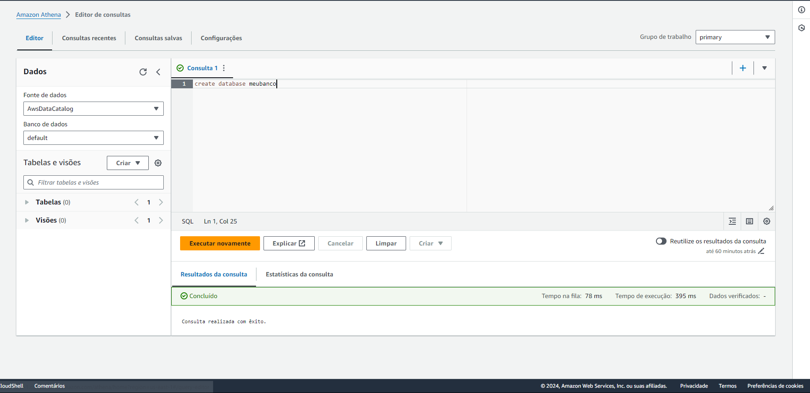
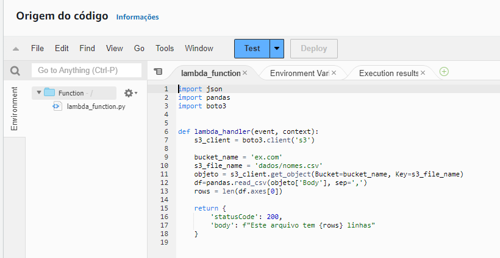

# Resumo

Nesta sprint, o foco foi o aprimoramento de habilidades em ferramentas analíticas da AWS por meio da plataforma AWS Skill Builder. Foram realizados treinamentos que cobriram desde os fundamentos de análise de dados na AWS, uso de serviços serverless, como AWS Glue e Athena, até boas práticas em Amazon Redshift e introdução ao Amazon EMR e QuickSight. O objetivo foi aprofundar o conhecimento nas ferramentas de big data e análise da AWS para otimizar o uso desses serviços para o desafio final.

# Exercícios

## Exercício 1

   Criação do bucket nomeado "ex.com".

Desabilitando o bloqueio de acesso público e definindo políticas.

Upload do arquivo "nomes.csv" dentro do diretório dados.

Resultado ao se redirecionar ao endpoint do site estático.

***

## Exercício 2

   Criação do banco de dados.

Criação da tabela que contém os tipos de dados do csv.

Primeira consulta de teste, para verificação.

Query requerida na atividade, sobre listar os 3 nomes mais usados em cada década desde o 1950 até hoje.

Resposta da consulta.

***

## Exercício 3

Definindo o lambda function.

Definindo o Dockerfile.

Construção da imagem via CMD.

Instalação da lib Pandas.

Copiando arquivos de dentro do container para a maquina local, possibilitando assim fazer o upload para o bucket S3.

Criação da camada "PandaSlayer".

Exibição do resultado do teste.

# Certificados

Os certificados estão todos dentro do diretório "certificados", e podem ser evidenciados ao clicar [aqui](../Sprint%206/certificados).

