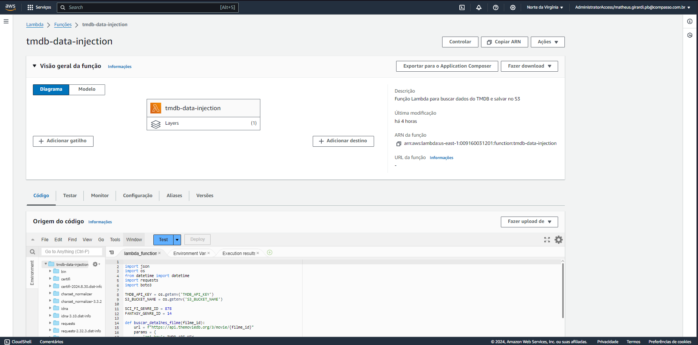

# Desafio

Esta etapa do desafio foca em coletar dados de filmes e séries diretamente da API do TMDB usando uma função AWS Lambda. Esses dados são automaticamente armazenados no Amazon S3 em formato JSON, com até 100 registros por arquivo. O objetivo é expandir os dados já coletados anteriormente, de maneira simples e organizada, facilitando o gerenciamento e o acesso futuro a essas informações.

# Etapas

## Setando Camada e Role

Para iniciar o desafio, era necessário criar uma camada para fazer a função lambda funcionar. Nessa camada, que armazena bibliotecas não nativas, foram inseridas a requests e a tmdbv3api, como pode ser evidenciado na imagem a seguir.


Com o zip das libs, foi feito o upload no console da AWS, e criada a camada.


Também era necessário criar uma role, para que a função lambda pudesse rodar sem ter nenhum impedimento relacionado a falta de permissões. Logo, foi colocado as políticas AmazonS3FullAccess e AWSLambdaBasicExecutionRole.


---

## Código de automação

O código abaixo busca dados de filmes de gêneros Sci-Fi e Fantasy da API do The Movie Database (TMDB) e armazena esses dados em arquivos JSON dentro de um bucket no Amazon S3.

Para fazer o código de execução do Lambda, foi utilizado algumas bibliotecas e algumas variáveis de ambiente.


```
import json
import os
from datetime import datetime
import requests
import boto3

TMDB_API_KEY = os.getenv('TMDB_API_KEY')
S3_BUCKET_NAME = os.getenv('S3_BUCKET_NAME')

SCI_FI_GENRE_ID = 878
FANTASY_GENRE_ID = 14

```
As funções descritas trabalham juntas para buscar e salvar dados de filmes da API do TMDB. A função buscar_detalhes_filme obtém detalhes específicos de um filme, como o orçamento, fazendo uma requisição à API com base no ID do filme. Já a função buscar_filmes faz uma busca inicial por filmes dos gêneros Sci-Fi e Fantasy, e para cada filme encontrado, chama buscar_detalhes_filme para obter informações adicionais, retornando uma lista de filmes e o número total de páginas disponíveis na busca. Por fim, a função salvar_dados_s3 salva esses dados coletados em arquivos JSON organizados em lotes, e os carrega em um bucket no Amazon S3 para armazenamento.
```

def buscar_detalhes_filme(filme_id):
    url = f"https://api.themoviedb.org/3/movie/{filme_id}"
    params = {
        'api_key': TMDB_API_KEY,
        'language': 'en-US',
    }


    response = requests.get(url, params=params)
    if response.status_code != 200:
        print(f"Erro ao buscar detalhes do filme {filme_id}: {response.status_code}")
        return {}

    detalhes = response.json()
    return detalhes

def buscar_filmes(page=1):
    url = f"https://api.themoviedb.org/3/discover/movie"
    params = {
        'api_key': TMDB_API_KEY,
        'language': 'en-US',
        'with_genres': f'{SCI_FI_GENRE_ID},{FANTASY_GENRE_ID}',
        'page': page
    }
    
    response = requests.get(url, params=params)
    if response.status_code != 200:
        print(f"Erro na requisição: {response.status_code}")
        return []

    data = response.json()
    results = data.get('results', [])
    
    filmes = []
    for movie in results:
        # Pegar detalhes adicionais (budget) de cada filme
        detalhes = buscar_detalhes_filme(movie['id'])

        filme = {
            'id': movie['id'],
            'title': movie['title'],
            'budget': detalhes.get('budget', 0),
            'release_date': movie['release_date'],
            'popularity': movie['popularity'],
            'overview': movie.get('overview', 'N/A')
        }
        filmes.append(filme)
    
    return filmes, data.get('total_pages', 1)

def salvar_dados_s3(dados, nome_lote):
    s3 = boto3.client('s3')
    data_atual = datetime.now()
    ano = data_atual.strftime('%Y')
    mes = data_atual.strftime('%m')
    dia = data_atual.strftime('%d')

    for i in range(0, len(dados), 100):
        lote = dados[i:i + 100]
        nome_arquivo = f'{nome_lote}_{i // 100 + 1}.json'
        caminho_s3 = f"Raw/TMDB/JSON/{ano}/{mes}/{dia}/{nome_arquivo}"

        caminho_temp = f"/tmp/{nome_arquivo}"
        with open(caminho_temp, 'w', encoding='utf-8') as f:
            json.dump(lote, f, ensure_ascii=False, indent=4)
        
        print(f'Salvando {len(lote)} registros no arquivo {nome_arquivo}')

        try:
            s3.upload_file(caminho_temp, S3_BUCKET_NAME, caminho_s3)
            print(f"Arquivo {nome_arquivo} carregado com sucesso para {caminho_s3}")
        except Exception as e:
            print(f"Erro ao carregar o arquivo no S3: {e}")
```
A função lambda_handler é a função principal que coordena todo o processo. Quando a Lambda é acionada, ela inicia buscando filmes dos gêneros Sci-Fi e Fantasy da API do TMDB, página por página, até coletar no máximo 100 filmes ou atingir o limite de 500 páginas. Para cada filme, a função coleta detalhes adicionais como orçamento. Após reunir os filmes, ela chama a função para salvar esses dados em arquivos JSON e armazená-los no S3. 
```
def lambda_handler(event, context):
    todos_filmes = []
    pagina = 1
    total_paginas = 1
    max_filmes = 100

    print('Buscando filmes Sci-Fi e Fantasy...')

    while pagina <= total_paginas and len(todos_filmes) < max_filmes:
        filmes, total_paginas = buscar_filmes(pagina)
        
        restantes = max_filmes - len(todos_filmes)
        todos_filmes.extend(filmes[:restantes])

        print(f"Página {pagina} de {total_paginas} processada com {len(filmes)} filmes.")
        
        if pagina >= 500 or len(todos_filmes) >= max_filmes:
            print("Limite de páginas ou de filmes atingido. Parando busca.")
            break
        pagina += 1

    salvar_dados_s3(todos_filmes, 'Filmes_SciFi_Fantasy')

    return {
        'statusCode': 200,
        'body': json.dumps('Filmes de Sci-Fi e Fantasy carregados no S3.')
    }

```

---

## Código de envio para a AWS usando boto3

Para lançar o código anterior para o console AWS, foi utilizado o código abaixo, e colocando o código de automação em uma variável de string.


O código, de modo geral, possui os tokens/credenciais de acesso à AWS, e algumas variáveis com valores importantes, como ARN da role e da layer, API key, nome do bucket e nome que será colocado na função lambda que será gerada.

A função criar_pacote cria um ambiente virtual no diretório local e instala as bibliotecas necessárias dentro desse diretório, para que essas dependências possam ser incluídas no pacote da Lambda.

A função criar_zip armazena tanto o código da Lambda quanto suas dependências em um arquivo zip, e prepara para o envio à AWS.

Já a função criar_atualizar_lambda, primeiro inicia a sessão com as credenciais do início do código, e então define a lógica de criação ou atualização da função Lambda. Ela verifica se o diretório onde o pacote da função será criado já existe, e se sim, limpa esse diretório. Após, verifica se a função Lambda já existe. Se sim, atualiza o código, se não, cria uma nova função com as configurações necessárias (runtime, role, handler, variáveis de ambiente...). 
Por fim, confirma se a função foi criada ou atualizada com sucesso, automatizando o processo de deploy da Lambda na AWS.

O código pode ser visto clicando [aqui](../Desafio/lambda-function.py).

## Evidências 

Interface do Lambda com a função criada após execução do código no VSCode.



Em seguida, foi necessário apenas iniciar o evento de teste da função Lambda para que ela fosse executada e realizasse a automação conforme planejado.

Na interface do Amazon S3, foi possível confirmar o sucesso da operação, com o arquivo JSON sendo enviado corretamente para o diretório especificado no bucket, exatamente como implementado no código.


