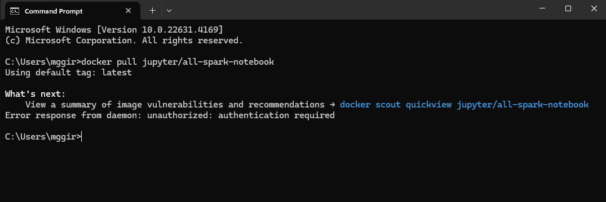
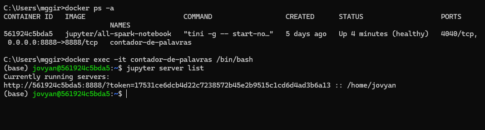
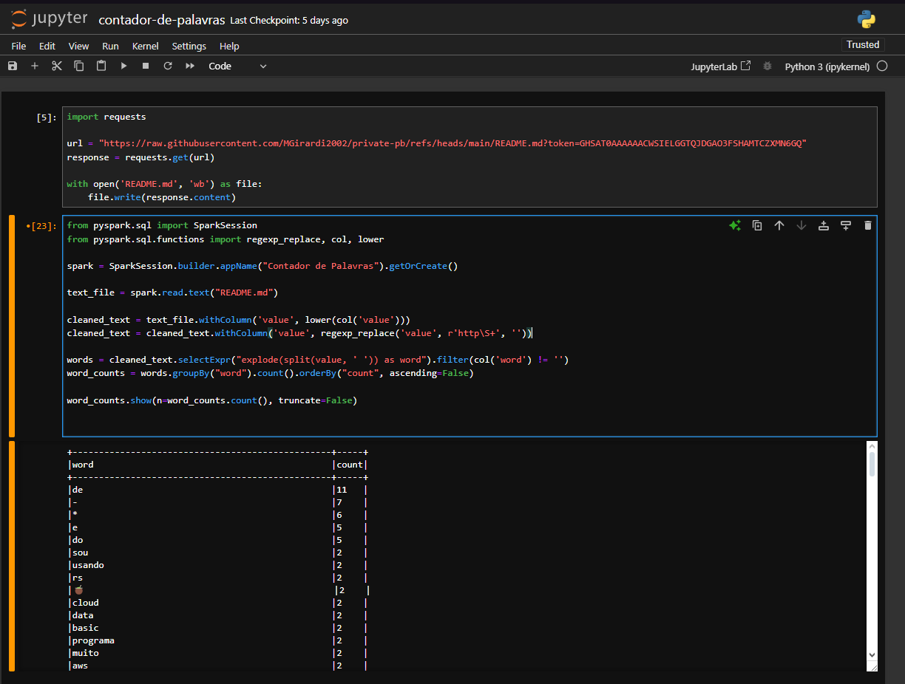

# Resumo

Na sprint 7, o foco esteve no desenvolvimento de competências em processamento distribuído com PySpark por meio do curso "Formação Spark com Pyspark". Foram abordados temas que iam desde a introdução ao PySpark e sua configuração no ambiente local, até a manipulação avançada de DataFrames e RDDs para trabalhar com grandes volumes de dados. Além disso, houve um aprofundamento nas técnicas de integração do Spark com SQL, permitindo consultas otimizadas em grandes bases de dados. O curso também explorou a criação de pipelines de dados e aplicações reais, além de cobrir boas práticas de otimização de desempenho. Ao final, foram discutidos tópicos complementares como monitoramento de jobs e ferramentas adicionais. O objetivo foi adquirir habilidades práticas e avançadas para o uso eficiente do PySpark em projetos de big data e análise distribuída.

# Exercícios

## Exercício Contador de Palavras

Primeiramente, foi feito o pull da imagem que será utilizada para desenvolver o exercício, no caso, a imagem "jupyter/all-spark-notebook".

Logo, a iniciação do container usando o comando docker run -p 8888:8888 -it --name contador-de-palavras jupyter/all-spark-notebook foi feita (não há imagens pois foi feita em outro dia). Quando o comando roda, ele inicia a imagem e mostra os links de token para abrir no jupyter.

Dentro do Jupyter foi criado um notebook chamado contador-de-palavras com duas células. Utilizou-se a biblioteca Python requests para fazer o download do arquivo README.md do meu repositório GitHub. Como o repositório é privado, um token foi necessário para autenticação. E depois isso, salva o arquivo como README.md.

Na segunda célula é iniciada uma sessão do Spark usando o PySpark. O SparkSession é o ponto de entrada para todas as funcionalidades de dados estruturados do Spark. Após a leitura do arquivo, ele faz uma série de tratamento das palavras, como deixá-las todas minúsculas, remover os links de http, e retirar outros caracteres que não são letras, números ou espaços. Depois da limpeza, separa-se as palavras utilizando espaços como delimitadores, e em seguida, conta quantas vezes cada palavra aparece no texto.

A última expressão do código serve para exibir todas as linhas do DataFrame resultante, sem truncar as palavras.

---

## Exercício Glue

[Resposta Ex2.](exercicios/ex2.txt)

