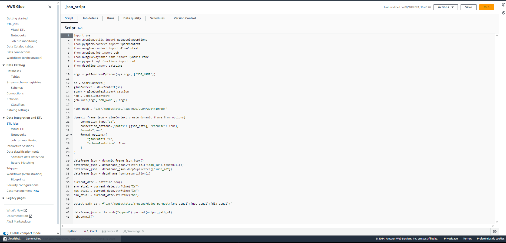

# Processamento Camada Trusted

Nesta etapa do projeto, o foco é realizar o processamento dos dados da Raw Zone para a Trusted Zone de um data lake utilizando Apache Spark e AWS Glue. O objetivo é garantir que os dados armazenados estejam limpos e padronizados, sendo gravados no formato Parquet e organizados por data de ingestão. Esse processamento torna os dados acessíveis para consulta via AWS Athena, permitindo análise eficiente através de comandos SQL.

# Etapas

1. Criação dos Jobs

Os jobs foram criados com o padrão "Script Editor", iniciando com fresh e engine Spark.

Evidencia-se ambos os scripts utilizados, tanto para o csv quanto para os json.

Cabe ressaltar que foram respeitadas as requisições de predefinições dos Job Details, como 2 workers, 60 minutos de timeout e worker type = G 1x

2. CSV Script

O script do csv é responsável por processar os dados do csv disponibilizado no desafio. Ele inicializa fazendo a leitura do CSV do pathing da camada Raw, com delimiter de pipe, header = True, inferSchema = True e o arquivo movies.csv. Em seguida, ele limpa os espaços em branco das colunas e filtra as linhas cujo gênero contenha "Sci-Fi", selecionando apenas as colunas "id", "tituloOriginal", "genero", e "anoLancamento". O script remove duplicatas com base no "id" e salva o resultado em um arquivo Parquet na camada Trusted, particionado por data atual.

O script JSON faz o processamento de arquivos JSON armazenados no bucket S3 na camada Raw. Ele lê os arquivos utilizando um DynamicFrame com a opção de recursão e ativando a evolução de esquema. Em seguida, converte o DynamicFrame para DataFrame, filtra os registros com imdb_id não nulos, e remove duplicatas com base no campo imdb_id. O DataFrame resultante é reparticionado para gerar um único arquivo e salvo no formato Parquet na camada Trusted, particionado por ano, mês e dia, com base na data de execução.

Após rodar ambos os códigos, eis as evidências de seus sucessos:

3. Crawler

Por fim, a criação do crawler com as seguintes configurações:

