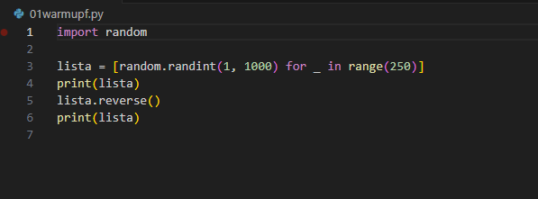
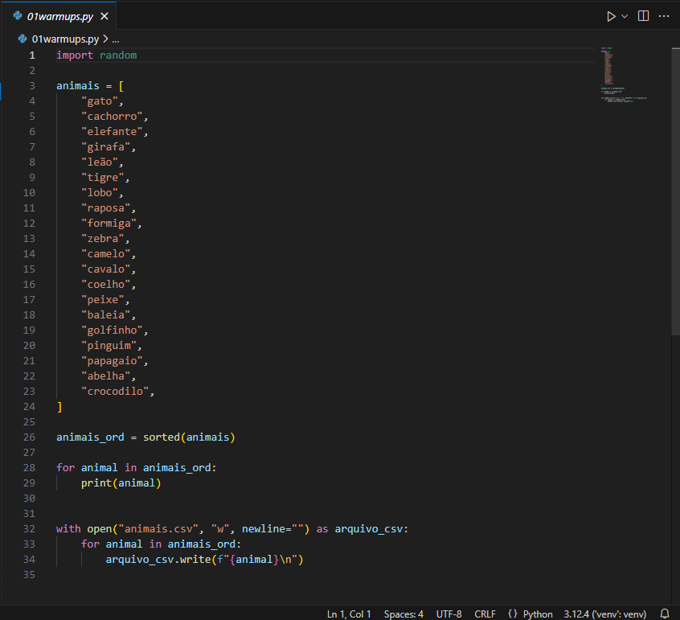
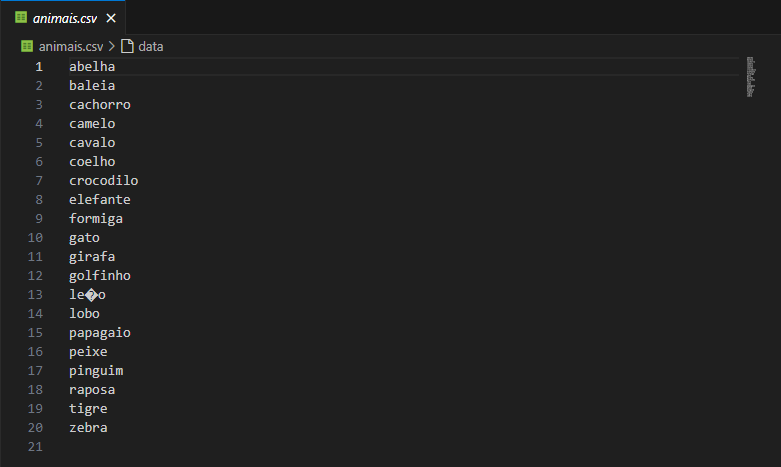
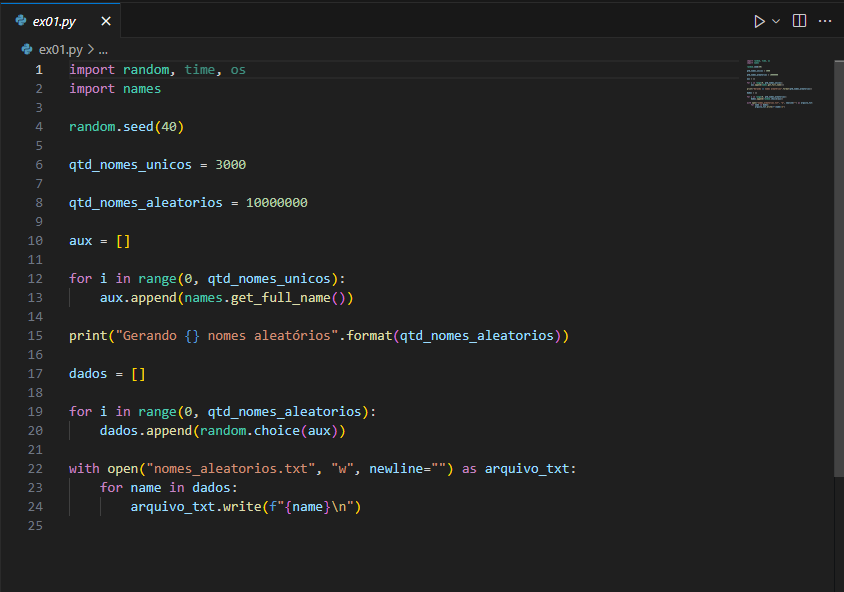
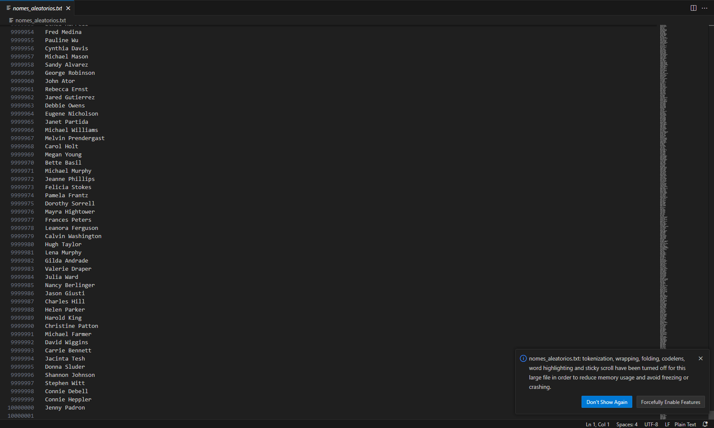
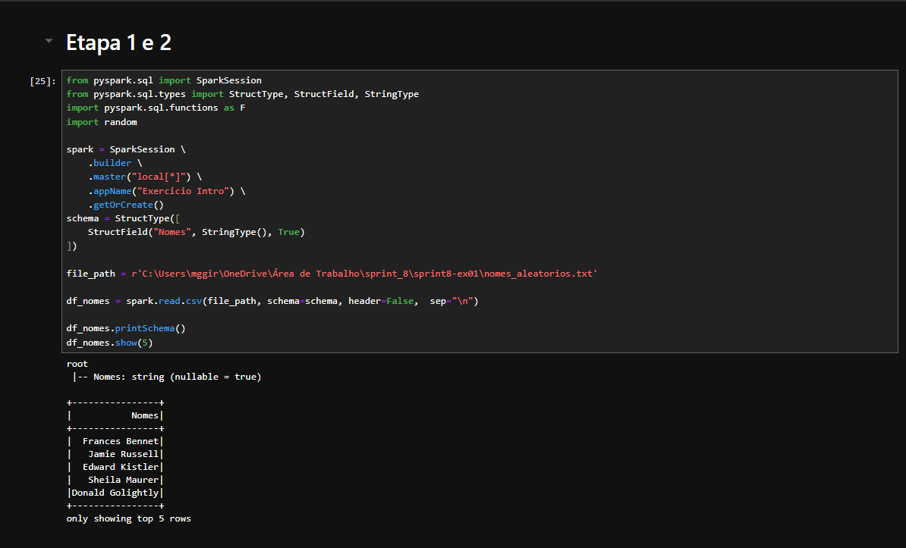
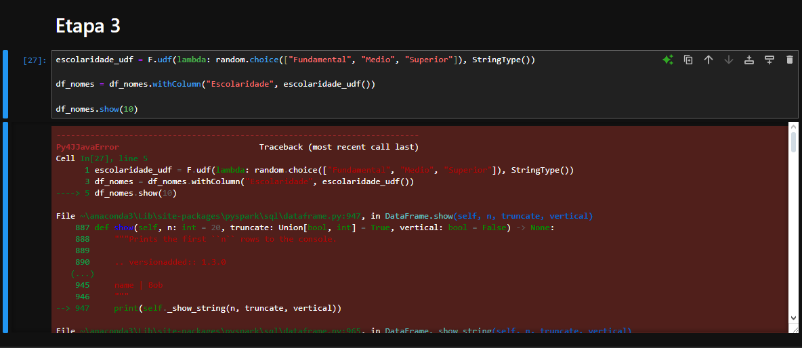
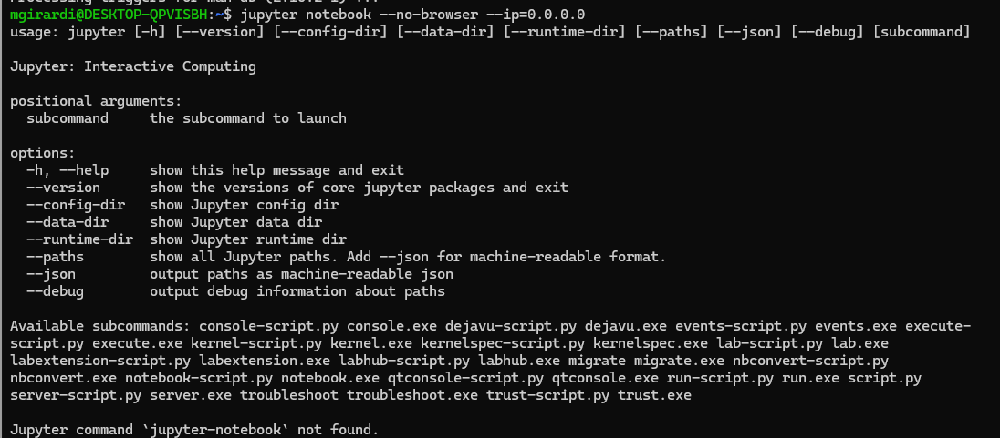

# Resumo

Nesta sprint, o foco foi higienizar a camada Raw do bucket S3, utilizando jobs do AWS Glue para transformar dados brutos em um formato padronizado e limpo, armazenando-os na camada Trusted no formato Parquet. Utilizamos PySpark para leitura e manipulação dos dados, com comandos como trim() para limpar espaços em branco, filter() para filtrar gêneros específicos, como "Sci-Fi", entre outros comandos..

# Exercícios

## Geração e massa de dados

Primeiro, foi requisitado dois warmups simples de randomização, listas e geração de arquivo csv.

Após isso, o exercício de verdade começa. Nele, era necessário gerar um arquiv com 10 milhões de nomes aleatórios, usando a lib names, que foi baixada em uma venv. Primeiramente, requisitava 3000 nomes únicos para armazenar em uma lista, com a função get_full_name(); Então, escolhendo aleatoriamente combinações dos nomes da lista aux, ele armazena em dados e 10 milhões de combinações, e então escreve no arquivo nomes_aleatorios.txt.

## Apache Spark

Esse exercício, não consegui concluir tudo que se pedia. Não pude resolver os conflitos das versões de pyspark do meu computador para setar os pathings. Também tentei fazer no WSL, mas continuei sem sucesso, sequer iniciar o jupyter notebook.

Aqui vai o desenvolvimento do exercício até os erros aparecerem.

### Primeira e Segunda Etapa
   
Na primeira e segunda etapa foi feito com sucesso o que se pediu, que era basicamente fazer a leitura do txt e setar um nome para a coluna de nomes. Para isso foi iniciado a sessão do spark, colocar as instruções que haviam no exercício e ler o arquivo gerado no exercício anterior.

### Terceira Etapa

Porém, a partir daqui, os erros começaram a aparecer. Tanto usando o próprio Windows, quanto ao tentar usar o WSL para abrir o servidor do Jupyter. Abaixo prints dos erros.

Certamente, eu poderia ter concluído este exercício mais cedo. No entanto, as últimas semanas têm sido bastante intensas, especialmente na faculdade, o que me levou a adiar o exercício para o final da sprint. Infelizmente, acabei sendo surpreendido por esses erros técnicos que, por ora, não parecem fazer sentido, visto que não conseguia sequer rodar o servidor, pois ele não encontrava o Jupyter, que inúmeras vezes foi instalado e desinstalado.
