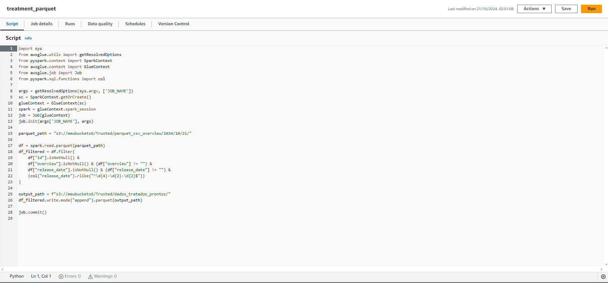

# Modelagem de Dados Camada Refined

Nesta etapa, o foco foi processar os dados da camada Trusted e prepará-los para a camada Refined. Utilizando o AWS Glue e Apache Spark, as tabelas foram organizadas seguindo o modelo multidimensional. As tabelas de dimensões (dim_title, dim_date, dim_overview) foram criadas para armazenar informações específicas, enquanto a tabela fato (fato_filme) foi utilizada para consolidar dados numéricos e relacionamentos. Os dados foram exportados para o formato Parquet, prontos para análise no QuickSight.

# Etapas

## CSV para Parquet Script

O job CSV_Parquet_Scriot realiza a transformação dos dados a partir do arquivo CSV, coletando informações adicionais com a API TMDB como orçamento (budget), popularidade (popularity) e overview dos filmes, associando essas informações com os registros de filmes presentes no dataset original. 

[Script](../Desafio/csv_parquet_script.py)

---

Já o job treatment_parquet faz o tratamento de um arquivo gerado na sprint anterior com os dados do JSON, filtrando linhas com valores nulos ou vazios em algumas colunas-chave, como id, overview, e release_date. Além disso, ele assegura que os dados de release_date estejam no formato yyyy-MM-dd. Então, o código salva o DataFrame tratado de volta em um novo arquivo Parquet no diretório especificado. O código foi usado duas vezes, tanto para o arquivo da sprint anterior, quanto para ao gerado pelo job CSV_Parquet_Script.

[Script](../Desafio/treatment_parquet.py)

Ambos os parquets higienizados foram finalmente movidos para a camada Refined.

---

## Crawler X Athena

A seguir, foi criado um Crawler para entrar na camada Refined e ler os arquivos parquet que nela se encontram.

Depois, utilizando o serviço Athena, foi confirmada a correta leitura dos parquet, que com o uso do crawler gerou uma table chamada refined, com os valores dos arquivos.

---

## Modelo Multidimensional

Por fim, restou-se desenvolver o modelo multidimensional. Foi utilizado o DBeaver para facilitar sua visualização, o qual possui um Star Schema, com uma tabela fato (fato_filme), que armazena métricas principais como budget, popularity, release_date, e title. As tabelas dimensão (dim_overview, dim_title, dim_date) fornecem atributos detalhados sobre essas métricas, organizando os dados para análises rápidas e eficientes em consultas.

